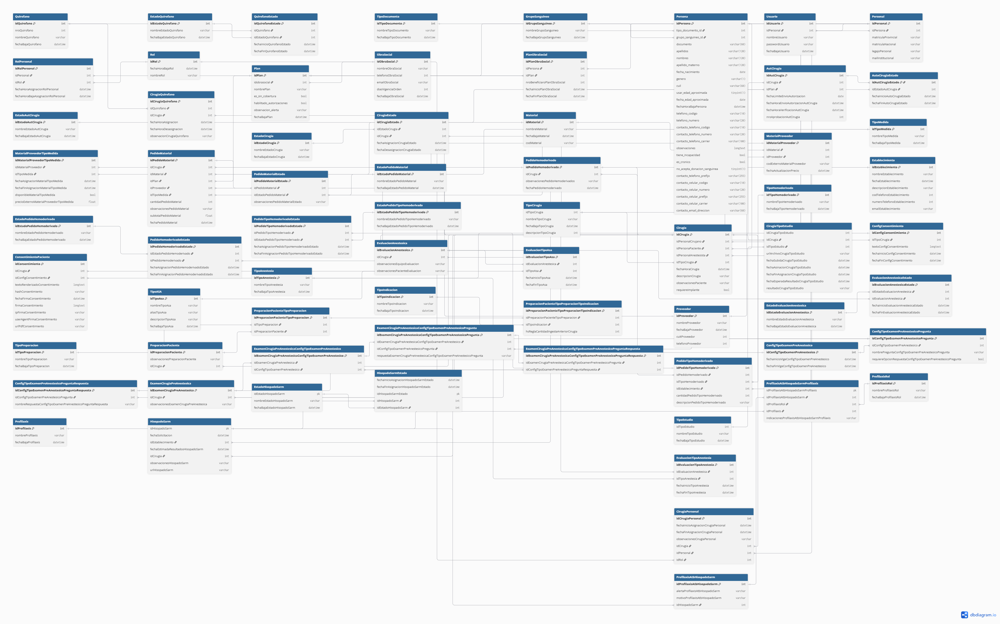

# StartMed

Sistema de gestión de cirugías del Hospital Universitario (UNCuyo): agenda de
quirófanos, autorizaciones ante obras sociales, pedidos de materiales y
hemoderivados, evaluación pre-anestésica, preparación del paciente y
consentimientos informados.

**🔗 Demo en vivo:** [startmed.onrender.com](https://startmed.onrender.com) — ver
*[Usuarios de prueba](#usuarios-de-prueba)* para entrar. Corre en el plan free de
Render, así que la primera carga después de un rato inactivo puede tardar.

---

## Puesta en marcha

### 1. Lo que necesitás instalado

| | Versión | Cómo verificar |
|---|---|---|
| PHP | 8.3 o superior | `php -v` |
| Composer | 2.x | `composer -V` |
| Node | 20 o superior | `node -v` |
| MySQL | 8.x | ver paso 3 |

En Windows, [Laragon](https://laragon.org/) trae PHP, MySQL y Node en un solo
paquete y es la forma más rápida de tener todo. En Linux o macOS instalalos por
separado o usá Docker/Herd.

> **Importante:** cloná el proyecto **dentro de `laragon/www`** (por ejemplo
> `C:\laragon\www\StartMed`). Laragon le arma el virtual host solo.

### 2. Dependencias

```bash
git clone https://github.com/LeandroLicata/StartMed.git
cd StartMed

composer install
npm install
```

### 3. Base de datos

Arrancá MySQL. En Laragon: botón **Start All** (esperá a que quede verde).

Creá la base vacía. Desde HeidiSQL (botón **Database** en Laragon) o por consola:

```sql
CREATE DATABASE startmed CHARACTER SET utf8mb4 COLLATE utf8mb4_unicode_ci;
```

### 4. Configuración

```bash
cp .env.example .env        # en PowerShell: copy .env.example .env
php artisan key:generate
```

El `.env.example` ya apunta a MySQL con las credenciales por defecto de Laragon
(usuario `root`, sin contraseña). **Si tu MySQL usa otro usuario, contraseña o
puerto**, editá esas líneas en el `.env`:

```env
DB_DATABASE=startmed
DB_USERNAME=root
DB_PASSWORD=
DB_PORT=3306
```

> El `.env` es tuyo y **no se sube al repo** — cada máquina tiene el suyo. El
> archivo que se comparte es `.env.example`. Si alguna vez agregás una variable
> nueva, agregala también ahí o al resto le va a fallar sin entender por qué.

### 5. Crear las tablas y cargar datos

```bash
php artisan migrate --seed
npm run build
```

Esto crea las 69 tablas, carga los catálogos y genera datos de demostración: seis
cirugías en distintos estados más seis meses de historial.

### 6. Levantarlo

```bash
composer run dev
```

Arranca tres procesos en paralelo — servidor, worker de colas y Vite — cada uno
con su color en la misma terminal. Se corta todo con `Ctrl+C`.

Abrí **http://127.0.0.1:8000** e ingresá con `admin` / `admin1234`.

Si preferís los procesos por separado, dos terminales:

```bash
php artisan serve     # terminal 1
npm run dev           # terminal 2
```

Con Laragon también funciona **http://startmed.test** sin necesidad de
`php artisan serve`; en ese caso solo hace falta `npm run dev` aparte si estás
tocando el frontend.

---

## Usuarios de prueba

Los crea el seeder. Cada uno aterriza en el panel que le corresponde a su rol.

| Usuario | Contraseña | Rol | Entra a |
|---|---|---|---|
| `admin` | `admin1234` | Administrador | todo |
| `gonzalez` | `demo1234` | Gestor de quirófano | `/dashboard` |
| `perez` | `demo1234` | Cirujano | `/cirujano` |
| `lopez` | `demo1234` | Cirujano | `/cirujano` |
| `ramos` | `demo1234` | Anestesista | `/anestesista` |
| `mgarcia` | `paciente1234` | Paciente | `/mi-salud` |

Un **403** al entrar a una sección no es un error: es el middleware `rol`
haciendo su trabajo. Probá con `admin`, que ve todo.

`mgarcia` es la paciente de una de las cirugías sembradas y entra a su portal,
pero **ese login es un atajo de demo**: el seeder le inventa una fila en
`Personal` sin legajo, porque `Usuario` cuelga de ahí. Ver *Pendientes
conocidos*.

---

## Problemas frecuentes

Los que más aparecen, con su síntoma exacto.

**La página carga sin ningún estilo, todo HTML pelado**

Quedó un archivo `public/hot` rancio. Le dice a Blade "los assets los sirve Vite
en el puerto 5173", pero Vite no está corriendo. Pasa cuando Vite se cierra de
golpe y no alcanza a limpiarlo.

```bash
rm public/hot        # PowerShell: Remove-Item public\hot
```

O simplemente volvé a levantar `npm run dev`.

**`could not find driver` o `Connection refused`**

MySQL está apagado. En Laragon, **Start All**.

**`Vite manifest not found`**

Faltan los assets compilados. Corré `npm run build`, o dejá `npm run dev`
corriendo mientras desarrollás.

**Cambié algo del `.env` y no toma efecto**

```bash
php artisan config:clear
```

**`php artisan db:table Cirugia` dice que la tabla no existe**

MySQL en Windows guarda los nombres de tabla en minúscula. Usá `cirugia`. Las
columnas sí conservan el `camelCase`.

**Después de un `git pull` algo dejó de andar**

Casi siempre son dependencias o migraciones nuevas:

```bash
composer install
npm install
php artisan migrate
php artisan config:clear
```

**Quiero volver a empezar de cero**

```bash
php artisan migrate:fresh --seed
```

Borra todo y lo vuelve a crear. Perdés cualquier dato que hayas cargado a mano.

**El script `dev` no muestra los logs**

A propósito. `php artisan pail` necesita la extensión `pcntl`, que **no existe en
PHP para Windows**, y como el script usa `--kill-others`, incluirlo hacía que
Pail muriera al arrancar y se llevara puestos a los otros tres procesos.

Los logs están en `storage/logs/laravel.log`:

```powershell
Get-Content storage\logs\laravel.log -Wait -Tail 20   # PowerShell
```

```bash
tail -f storage/logs/laravel.log                      # Linux / macOS
php artisan pail                                      # Linux / macOS
```

---

## Trabajar en equipo

### Cada uno tiene su propia base

No se comparte una base entre todos. El **esquema** viaja por migraciones y los
**datos de prueba** por seeders. Después de cada `git pull`, corré
`php artisan migrate`.

### La regla de oro con las migraciones

**Una migración que ya se pusheó no se edita nunca más.** Se crea una nueva.

Si editás un archivo de migración que tus compañeros ya corrieron, Laravel la ve
como "ya ejecutada" y nunca aplica tu cambio: la base de ellos y la tuya quedan
distintas, y el bug aparece días después en algo sin relación aparente.

```bash
php artisan make:migration agregar_columna_x_a_cirugia
```

### Cómo repartir el trabajo

La unidad natural no es el componente (como en React) sino la **entidad**: una
persona se lleva su módulo de punta a punta.

```
Quirófanos → QuirofanoController.php
             GuardarQuirofanoRequest.php
             resources/views/quirofanos/*
             una línea en routes/web.php
```

Como cada quien toca archivos distintos, casi no hay conflictos. Los archivos
compartidos son `routes/web.php` (una línea cada uno, en orden alfabético),
`resources/views/components/` y `DatabaseSeeder.php`.

**Los componentes de `resources/views/components/` los define una sola persona.**
Si necesitás uno nuevo, pedilo en vez de inventarlo, o van a terminar
conviviendo cuatro estilos distintos de input.

### Ramas

Una rama por entidad, no por persona. Nadie commitea a `main` directo.

```bash
git checkout -b quirofanos
# ...
php artisan test        # tiene que pasar antes del PR
git push -u origin quirofanos
gh pr create
```

---

## Cómo está armado

### Stack

| | |
|---|---|
| PHP | 8.3 |
| Laravel | 13.8 |
| Base de datos | MySQL 8.4 (`startmed`) |
| Frontend | Blade + Vite 8 + Tailwind CSS 4 |
| Tests | PHPUnit 12 |
| Archivos clínicos | Cloudinary (`authenticated`), con fallback a disco local |
| Despliegue | Docker + Render (`render.yaml`), MySQL externo (Aiven) |

**No hay React.** El HTML se arma en el servidor con Blade y llega al navegador
ya terminado. El único JavaScript propio es el que abre y cierra el menú lateral
en pantallas chicas.

### Pantallas

| Ruta | Quién entra | Qué muestra |
|---|---|---|
| `/dashboard` | Gestor, Dirección | Cirugías próximas y qué le falta a cada una |
| `/cirujano` | Cirujano | Sus cirugías, su tasa de suspensión, procedimientos |
| `/anestesista` | Anestesista | Sus evaluaciones, ASA, cuestionarios, alergias |
| `/direccion` | Dirección médica | Serie de 6 meses, suspensiones, uso de quirófanos |
| `/cirugias/{id}` | Autenticados | Expediente completo de una cirugía |
| `/cirugias/{id}/portal-paciente` | Autenticados | Vista previa de lo que ve el paciente |
| `/mi-salud` | Paciente | Su portal — **maqueta**, ver *Pendientes conocidos* |
| `/admin` | Administrador | Índice de los 27 catálogos maestros |
| `/admin/usuarios`, `/admin/consentimientos`, `/admin/precios`, `/admin/auditoria` | Administrador | Los módulos que no son catálogo genérico — ver *Administración* |
| `/admin/cuestionario` | Administrador, **Anestesista** | Cuestionario pre-anestésico (el único módulo de `/admin` que no es solo del administrador) |

Los listados que crecen sin techo están paginados: cirugías de la semana del
tablero, la agenda del cirujano, la bandeja del anestesista y las pantallas de
`/admin`. Los indicadores de cada panel siguen contando sobre el total, no
sobre la página que se está viendo.

El acceso lo controla el middleware `rol`, que lee `RolPersonal` contando solo
las asignaciones vigentes. El Administrador entra a todo.

### Identidad visual

Los colores salen del Manual de Marca del Hospital Universitario y están como
tokens de Tailwind en [`resources/css/app.css`](resources/css/app.css):

| Token | Valor | |
|---|---|---|
| `hu-azul` | `#003764` | Pantone 2955 C |
| `hu-dorado` | `#C7A36E` | Pantone 465 M |
| `hu-gris` | `#59595B` | texto |

Se usan como `bg-hu-azul`, `text-hu-dorado`, etc. Los tonos `-claro`, `-oscuro`,
`-suave` y `-tenue` **no están en el manual**: se derivaron para hover, estado
activo y fondos.

La tipografía es **Montserrat** (regular, semibold, black). Se descarga durante
el build y queda self-hosted.

Los componentes reutilizables están en
[`resources/views/components/`](resources/views/components/):

```blade
<x-boton>Guardar</x-boton>                   {{-- confirmación: radio máximo --}}
<x-boton forma="grupo">Filtrar</x-boton>     {{-- grupo de botones: 12px --}}

<x-input nombre="nombreQuirofano" etiqueta="Nombre" requerido />
<x-alerta tipo="exito">Guardado.</x-alerta>
<x-estado tono="aviso">En auditoría</x-estado>
<x-tarjeta titulo="Materiales" icono="inventory_2"> ... </x-tarjeta>
```

`<x-input>` muestra solo su propio error de validación y conserva lo que el
usuario había tipeado; no hace falta pasarle nada.

Los íconos son [Material Symbols](https://fonts.google.com/icons). **Si usás uno
nuevo, agregalo a la lista `icon_names` del `<link>` en
[`layouts/app.blade.php`](resources/views/layouts/app.blade.php)** o no se va a
ver: la hoja de estilos viene subseteada para que pese poco.

---

## Administración

`/admin` es el único lado de escritura de datos maestros de la app (crear/editar
cirugías también escribe, pero por otro camino). Un solo controlador genérico
(`Admin\CatalogoController`) sirve los **27 catálogos maestros** a partir de un mapa
declarado en [`App\Support\Catalogos`](app/Support/Catalogos.php) — agregar un
catálogo nuevo es agregar una entrada al mapa, no escribir un controlador.

Cuatro cosas no entran en ese mapa genérico porque tienen forma propia y viven cada
una en su pantalla:

| Módulo | Ruta | Por qué es distinto |
|---|---|---|
| Usuarios | `/admin/usuarios` | Crear un usuario escribe 4 tablas (`Persona` → `Personal` → `Usuario` → `RolPersonal`) en una transacción |
| Consentimientos | `/admin/consentimientos` | Las plantillas se **versionan**, no se editan: publicar cierra la versión vigente y abre una nueva |
| Cuestionario pre-anestésico | `/admin/cuestionario` | Se congela apenas alguien lo responde; versión → preguntas → opciones en una sola pantalla |
| Proveedores y precios | `/admin/precios` | El precio cuelga de la unidad de venta (`MaterialProveedorTipoMedida`), no del proveedor |

**Toda acción queda auditada.** Como ninguna tabla tiene `created_at`,
[`App\Support\Auditor`](app/Support/Auditor.php) escribe una fila en `Auditoria` por
cada alta/baja/edición desde `/admin` — quién, cuándo, qué acción, sobre qué registro
y un diff en JSON de los campos que cambiaron. Se consulta en `/admin/auditoria`,
filtrable por autor, acción y tabla.

**Las bajas son siempre lógicas** (se escribe `fechaBaja*`, nunca `DELETE`) y algunas
filas de catálogo son "del sistema": la app las busca por nombre literal (`'Realizada'`,
`'Aprobada'`, los estados de hisopado, etc.), así que renombrarlas rompería paneles
enteros sin avisar. Esas filas están protegidas contra edición/baja desde el ABM.

---

## Archivos clínicos

Los resultados de estudios (`CirugiaTipoEstudio`) y de hisopados SARM (`HisopadoSarm`)
son datos de salud identificables, así que nunca se sirven de forma pública.
[`App\Support\GestorDocumental`](app/Support/GestorDocumental.php) es la interfaz que
lo garantiza: sube a Cloudinary como `authenticated` (nunca `public`) y la columna en
la base guarda un **puntero opaco**, no una URL — la URL firmada y con vencimiento se
genera recién al momento de mostrarla (`urlTemporal()`), nunca se persiste.

Sin `CLOUDINARY_URL` configurada, cae automáticamente al disco local
(`storage/app`), así que un clon nuevo del repo puede sembrarse y probarse sin cuenta
de Cloudinary y la suite de tests nunca pega contra la red real
(`GestorDocumentalTest::test_la_suite_nunca_corre_contra_cloudinary`).

```bash
php artisan documentos:limpiar-huerfanos          # solo reporta
php artisan documentos:limpiar-huerfanos --borrar  # borra lo que ya no referencia nadie
```

Reemplazar un archivo (re-subir un estudio) deja el anterior huérfano en Cloudinary a
propósito — nada en el camino de escritura borra el archivo viejo. Este comando es lo
que después lo limpia; corre semanal por cron **solo en modo reporte**, borrar es
manual.

---

## Despliegue

Hay un `Dockerfile` y un `render.yaml` (Blueprint) para desplegar en
[Render](https://render.com) — es como corre la demo. La base de datos MySQL vive
afuera de Render (por ejemplo [Aiven](https://aiven.io)); el Blueprint deja esas
variables (`DB_HOST`, `DB_PASSWORD`, `CLOUDINARY_URL`, etc.) sin valor a propósito
para cargarlas a mano en el dashboard. Migraciones y seeders corren en el arranque
del contenedor (`docker/entrypoint.sh`), porque `preDeployCommand` no está disponible
en el plan free.

---

## Base de datos

**69 tablas** de dominio y **80 foreign keys**, en 15 migraciones por módulo.
Cada una crea sus tablas en orden de dependencia y las borra en orden inverso,
así que `migrate:rollback` funciona limpio.

| Migración | Módulo |
|---|---|
| `..._100100_create_persona_tables` | TipoDocumento, GrupoSanguineo, Persona |
| `..._100200_create_personal_rol_usuario_tables` | Rol, Personal, Usuario, RolPersonal |
| `..._100300_create_obra_social_tables` | ObraSocial, Plan, PlanObraSocial |
| `..._100400_create_quirofano_tables` | Quirofano y sus estados |
| `..._100500_create_cirugia_table` | TipoCirugia, Cirugia |
| `..._100600_create_cirugia_relacionadas_tables` | estados, quirófano asignado, equipo, autorizaciones, estudios |
| `..._100700_create_material_tables` | Material, Proveedor, TipoMedida, PedidoMaterial |
| `..._100800_create_hemoderivado_tables` | TipoHemoderivado, Establecimiento, PedidoHemoderivado |
| `..._100900_create_evaluacion_anestesica_tables` | TipoASA, TipoAnestesia, EvaluacionAnestesica |
| `..._101000_create_preparacion_paciente_tables` | TipoPreparacion, TipoIndicacion, PreparacionPaciente |
| `..._101100_create_examen_preanestesico_tables` | config de preguntas/respuestas y examen del paciente |
| `..._101200_create_profilaxis_tables` | Profilaxis, ProfilaxisRol |
| `..._101300_create_consentimiento_tables` | ConfigConsentimiento, ConsentimientoPaciente |
| `..._101400_create_hisopado_sarm_tables` | HisopadoSarm, sus estados y la profilaxis que depende del resultado |
| `..._101400_create_auditoria_table` | Auditoria (la única tabla que no viene del modelo de datos) |

### Diagrama



### Convenciones del esquema

Son deliberadas: el esquema sigue un modelo de datos previo, no las convenciones
de Laravel. **No las "arregles".**

- **Nombres del modelo de datos.** Tablas en `PascalCase` (`Cirugia`,
  `PedidoMaterial`), PKs `idXxx`, columnas en `camelCase`. `Persona` es la
  excepción: usa `snake_case`, tal como venía en el diseño original.
- **Sin `created_at` / `updated_at`.** Ninguna tabla los tiene, por eso todos los
  modelos declaran `public $timestamps = false`.
- **Bajas lógicas.** Las columnas `fechaBaja*` y `fechaHoraBaja*` marcan la baja;
  no se usa `SoftDeletes`.
- **Historial por rangos de fecha.** Las tablas de estado (`CirugiaEstado`,
  `QuirofanoEstado`, …) guardan la línea de tiempo con `fechaInicio*` /
  `fechaFin*` en vez de pisar un campo de estado. **El registro vigente es el que
  tiene la fecha de fin en `NULL`.**
- **Constraints con nombre explícito** (`fk_<tabla>_<ref>`), porque los nombres
  autogenerados por Laravel superaban el límite de 64 caracteres de MySQL.

### Nombres acortados

Tres tablas del examen pre-anestésico no entraban en esos 64 caracteres:

| Diseño original | En la base |
|---|---|
| `ExamenCirugiaPreAnestesicaConfigTipoExamenPreAnestesico` | `ExamenPreAnestesicoConfig` |
| `…ConfigTipoExamenPreAnestesicoPregunta` | `ExamenPreAnestesicoConfigPregunta` |
| `…ConfigTipoExamenPreAnestesicoPreguntaRespuesta` | `ExamenPreAnestesicoConfigPreguntaRespuesta` |

### Nombres en minúscula (Windows)

MySQL en Windows corre con `lower_case_table_names=1`, así que guarda los nombres
de tabla en minúscula: `Cirugia` queda como `cirugia`. Las columnas conservan su
`camelCase`.

No rompe nada en Windows porque MySQL compara sin distinguir mayúsculas, pero en
Linux sí distingue. Como migraciones y modelos usan siempre el mismo string queda
consistente igual — pero tenelo presente antes de un deploy.

### Inspeccionar la base

```bash
php artisan db:show           # todas las tablas y su tamaño
php artisan db:table cirugia  # columnas, tipos e índices
php artisan db                # cliente SQL interactivo
```

En Laragon, el botón **Database** abre HeidiSQL ya conectado.

---

## Modelos

**69 modelos** en [`app/Models/`](app/Models/), uno por tabla, con **162
relaciones** (80 `belongsTo`, 78 `hasMany`/`hasOne`, 3 `belongsToMany`).

Los nombres de relación derivan de **la columna, no de la tabla**, para que
varias FK a la misma tabla no colisionen:

```php
// app/Models/Cirugia.php
public function paciente(): BelongsTo      // idPersonaPaciente     → Persona
public function cirujano(): BelongsTo      // idPersonalCirujano    → Personal
public function anestesista(): BelongsTo   // idPersonalAnestesista → Personal
```

Si agregás una relación, seguí ese criterio.

### Leer el estado de una cirugía

No armes las consultas a mano: [`App\Support\ResumenCirugia`](app/Support/ResumenCirugia.php)
ya resuelve el estado vigente de cada módulo y responde qué le falta a una
cirugía para poder realizarse.

```php
$cirugias = Cirugia::with(ResumenCirugia::RELACIONES)
    ->where('fechaHoraCirugia', '>=', today())
    ->get()
    ->map(fn ($c) => new ResumenCirugia($c));

$caso->estaLista();        // bool
$caso->pendientes();       // ['Autorización en auditoría médica', '1 estudio sin subir']
$caso->autorizacion();     // 'Aprobada'
$caso->asa();              // 'ASA III'
$caso->semaforo();         // 'exito' | 'aviso' | 'error'
```

Las constantes `RELACIONES` y `RELACIONES_EXPEDIENTE` fijan el eager loading.
**Usalas** — si accedés a una relación sin cargarla, cada fila de la tabla
dispara su propia consulta y hay un test que lo detecta.

---

## Tests

```bash
php artisan test
php artisan test --filter=ModelosTest
```

Corren sobre SQLite en memoria (ver `phpunit.xml`) y **no tocan tu base de
desarrollo**.

| Archivo | Qué cubre |
|---|---|
| [`ModelosTest`](tests/Feature/ModelosTest.php) | Recorre por reflexión los 69 modelos y sus 162 relaciones: que la tabla y la PK existan, que cada relación compile a SQL y que todas sus columnas existan |
| [`Auth/LoginTest`](tests/Feature/Auth/LoginTest.php) | Login, contraseña incorrecta, hasheo, usuario dado de baja, ruta inicial por rol |
| [`DashboardTest`](tests/Feature/DashboardTest.php) | Semáforo de cada cirugía y que las consultas no crezcan con el número de filas |
| [`PanelesTest`](tests/Feature/PanelesTest.php) | Que cada rol vea lo suyo y no lo ajeno, y el cálculo de horas de ayuno |

`ModelosTest` es la red de seguridad del esquema: si agregás una tabla sin su
modelo, o renombrás una columna sin actualizar el modelo, falla.

---

## Autenticación

El login **no usa la tabla `users` de Laravel**, usa la tabla `Usuario` del
dominio. La de Laravel fue eliminada para que no queden dos fuentes de verdad; de
la migración original solo sobrevive `sessions`.

[`App\Models\Usuario`](app/Models/Usuario.php) traduce el esquema propio a lo que
espera el guard:

- `getAuthPassword()` devuelve `passwordUsuario`
- el cast `'passwordUsuario' => 'hashed'` hashea al asignar
- `getRememberTokenName()` devuelve `null` (no hay columna `remember_token`, así
  que "recordarme" está deshabilitado)

Se entra por `nombreUsuario`, con `throttle:6,1`, y se rechaza a los usuarios con
`fechaBajaUsuario` seteada.

---

## Pendientes conocidos

Cosas que **no** están hechas y conviene saber antes de asumir que se puede:

**El portal del paciente es una maqueta y su login es falso.** `/mi-salud` se
navega y `mgarcia` entra, pero `PortalPacienteMock` guarda el estado en la
sesión y devuelve datos inventados: **ninguna de esas pantallas lee el
expediente real**. No construyas encima como si estuviera conectado al dominio.
Y el paciente entra porque el seeder le inventa una fila en `Personal` sin
legajo — `Usuario` cuelga de ahí y un paciente es una `Persona` sin legajo.
Cómo se autentica un paciente de verdad (link firmado, login propio, otra
tabla) sigue sin decidirse, y es lo que hay que resolver antes de que esto sea
real. Distinto es `/cirugias/{id}/portal-paciente`, que sí lee el expediente:
es la vista previa que abre el equipo.

**No hay reseteo de contraseña por email.** `config/auth.php` tiene
`'passwords' => []` porque `Usuario` no tiene columna de email — el correo vive
en `Personal.mailInstitucional` y en `Persona.contacto_email_direccion`, y hay
que elegir cuál es el canal oficial.

**No se puede saber por qué se suspendió una cirugía.** `CirugiaEstado` registra
*que* se suspendió, no *por qué*. Hasta que exista una tabla de motivos, el panel
de Dirección no puede desglosar las suspensiones por causa.

**La preparación del paciente (ayuno, indicaciones) no se carga desde el alta de
cirugía.** Los catálogos existen y `ResumenCirugia` ya sabe leerlos, pero cargarlos
quedó afuera del formulario de alta a propósito (ya tiene demasiados pasos) — falta
la pantalla de gestión donde el cirujano/gestor los cargue después.

**El hisopado SARM solo tiene el pedido, no el resultado.** Desde el alta de cirugía
se puede tildar "pedir hisopado", pero no hay pantalla todavía para cargar el
resultado, el laboratorio, ni la profilaxis que debería derivar de un positivo.

**Cuatro tablas maestras quedan fuera del ABM genérico de catálogos** —
`ConfigConsentimiento`, `ConfigTipoExamenPreAnestesico*` y
`MaterialProveedor`/`MaterialProveedorTipoMedida` tienen su propia pantalla (ver
*Administración*) porque son historiadas o anidadas. `PlanObraSocial` es la única
que todavía no tiene pantalla propia.

**Los pacientes no se gestionan desde `/admin`.** El ítem "Pacientes" del menú
sigue deshabilitado; una `Persona` que no es personal no tiene pantalla propia.

---

## Comandos útiles

```bash
php artisan migrate:fresh --seed   # recrear la base desde cero
php artisan migrate:rollback       # deshacer el último batch
php artisan route:list             # todas las rutas
php artisan config:clear           # después de tocar el .env
./vendor/bin/pint                  # formatear el código (correr antes del PR)
php artisan test                   # la suite completa
```

---

## Equipo

| | LinkedIn | GitHub |
|---|---|---|
| Leandro Licata | [linkedin](https://www.linkedin.com/in/leandro-licata/) | [@LeandroLicata](https://github.com/LeandroLicata) |
| Matías Rodríguez | [linkedin](https://www.linkedin.com/in/matias-rodriguez-156363229/) | [@MatiasRodriguez30](https://github.com/MatiasRodriguez30) |
| Gonzalo Tapia | [linkedin](https://www.linkedin.com/in/gonzalo-nicolas-tapia/) | [@Gonzalo-Tapia](https://github.com/Gonzalo-Tapia) |
| Jonatan Cala | [linkedin](https://www.linkedin.com/in/jhonni-cala-196730308/) | [@cala-jhonni1046](https://github.com/cala-jhonni1046) |
| Federico Calafiore | — | [@Fede1809](https://github.com/Fede1809) |
